<p align="center">
  <picture>
    <source media="(prefers-color-scheme: dark)" srcset="docs/screenshots/tango-uebersicht-dark.png">
    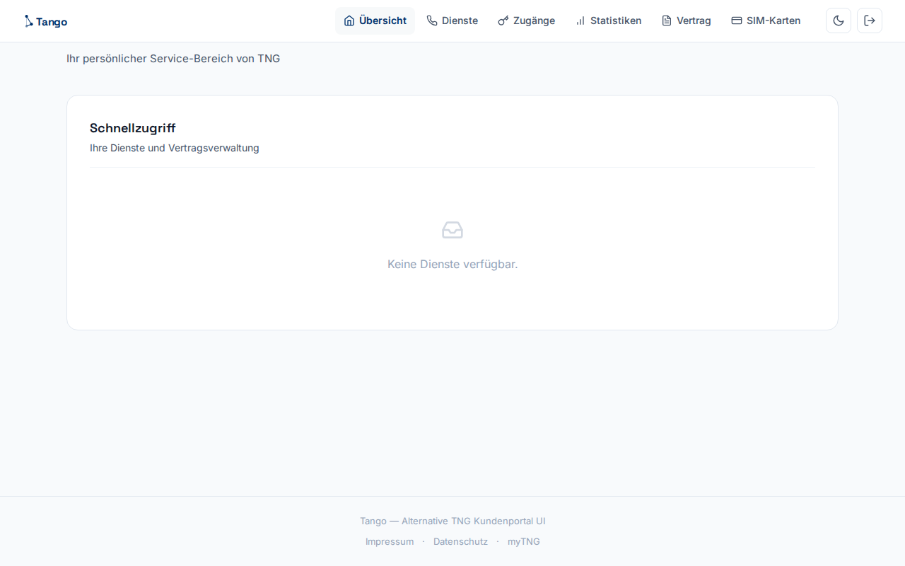
  </picture>
</p>

<h1 align="center">⚡ Tango</h1>

<p align="center">
  A modern, responsive alternative UI for the <strong>myTNG</strong> customer portal.<br>
  Built with Astro SSR · Cheerio · TNG navy design system · Dark mode
</p>

<p align="center">
  <a href="https://tango.jakob-lingel.dev">🔗 Live Demo</a> ·
  <a href="#features">Features</a> ·
  <a href="#screenshots">Screenshots</a> ·
  <a href="#tech-stack">Tech Stack</a> ·
  <a href="#architecture">Architecture</a>
</p>

---

## The Problem

The original [myTNG](https://www.mytng.de) portal works, but it looks like it was built in 2008 — because it was. It's a Liferay-based application with dense tables, no dark mode, no mobile optimization, and a visual style that hasn't aged well.

**Tango** is a complete front-end rewrite. It scrapes the real myTNG backend via server-side HTML parsing and presents the same data in a clean, modern interface — without modifying any backend systems.

### Before & After

<table>
  <tr>
    <td width="50%" align="center"><b>myTNG (original)</b></td>
    <td width="50%" align="center"><b>Tango (redesign)</b></td>
  </tr>
  <tr>
    <td></td>
    <td></td>
  </tr>
  <tr>
    <td></td>
    <td>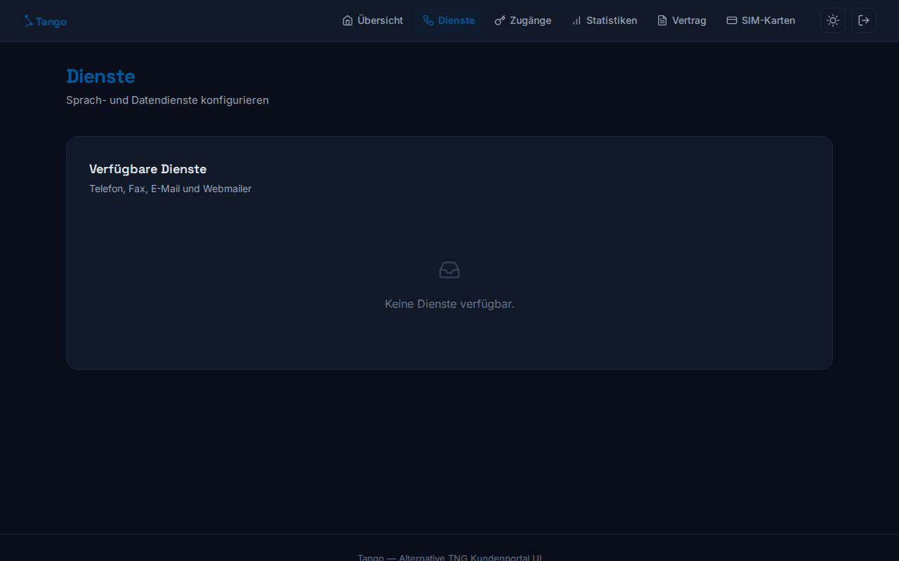</td>
  </tr>
  <tr>
    <td align="center"></td>
    <td align="center">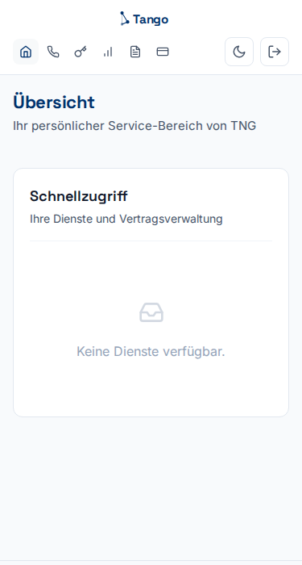</td>
  </tr>
</table>

## Features

- 🎨 **Clean, modern design** — TNG navy color palette, Space Grotesk + Inter typography
- 🌙 **Dark mode** — automatic system preference detection + manual toggle
- 📱 **Fully responsive** — mobile-first layout with adaptive navigation
- 🔐 **Real authentication** — proxies login to the real myTNG backend, session-based
- 📊 **Six pages** — Übersicht, Dienste, Zugänge, Statistiken, Vertrag, SIM-Karten
- 🧩 **Shared component system** — `PageSection` ensures pixel-consistent layout across all pages
- ⚡ **Inline SVG icons** — Lucide-style, no icon font dependency
- 🚀 **SSR with Astro** — server-side rendered, no client JS framework overhead
- 🔒 **No backend changes** — Cheerio scrapes and parses existing myTNG HTML

## Screenshots

### Light Mode

<p float="left">
  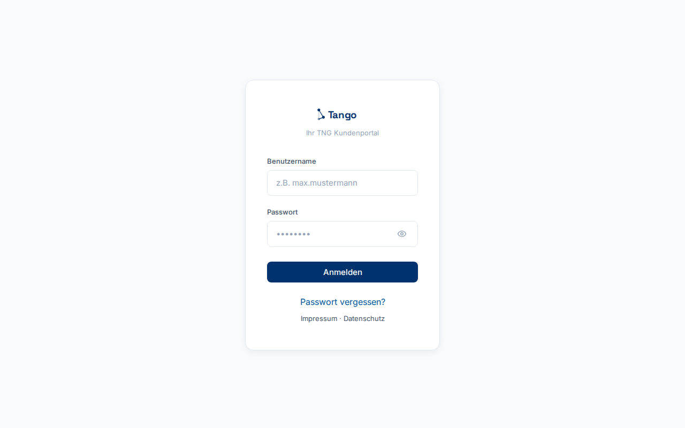
  
  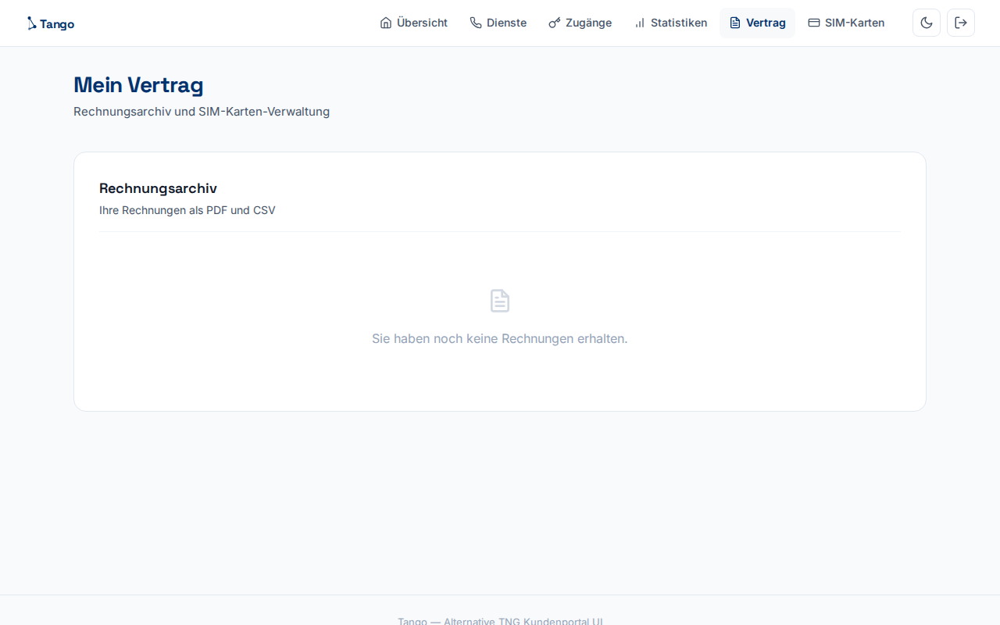
</p>

<p float="left">
  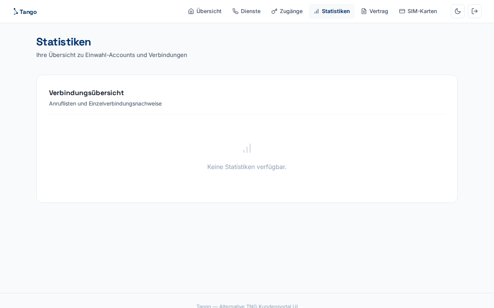
</p>

### Dark Mode

<p float="left">
  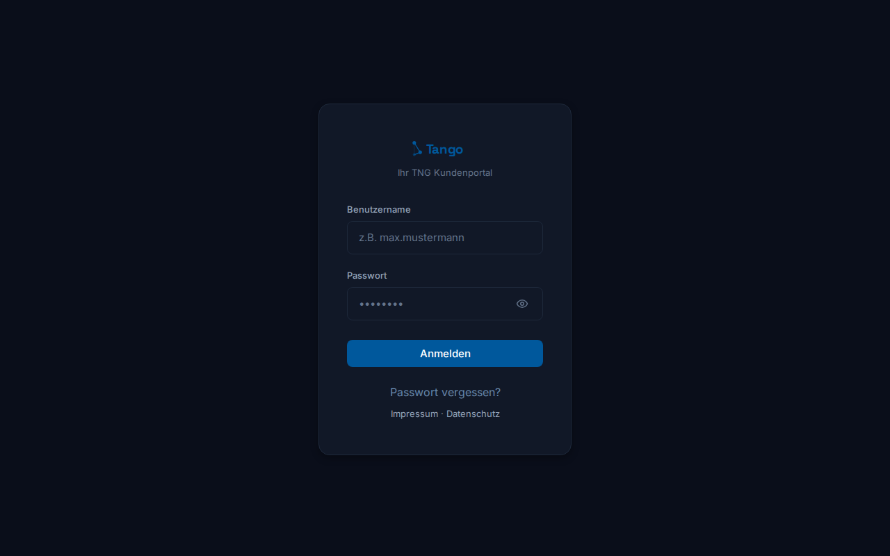
  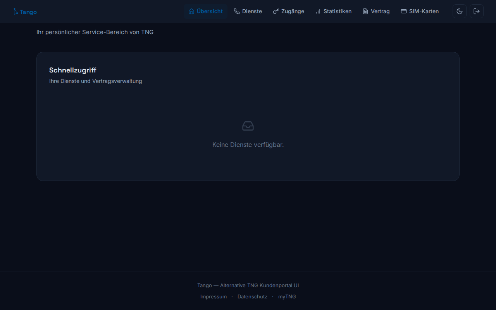
  
</p>

<p float="left">
  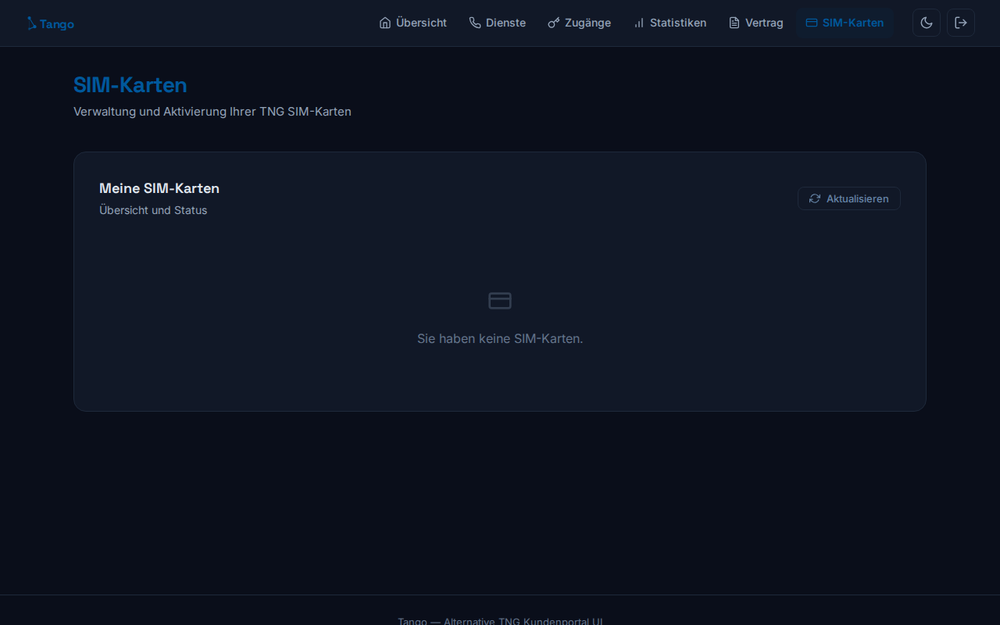
</p>

### Mobile

<p float="left">
  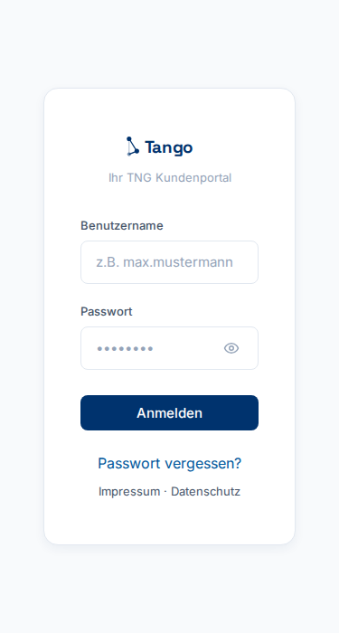
  
  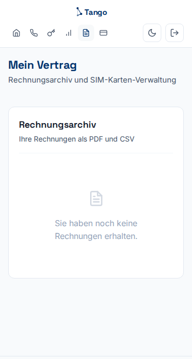
</p>

## Tech Stack

| Layer | Technology |
|-------|-----------|
| **Framework** | [Astro](https://astro.build) 7.x (SSR, Node standalone adapter) |
| **HTML Parsing** | [Cheerio](https://cheerio.js.org) 1.2 — scrapes Liferay portal HTML |
| **Styling** | Vanilla CSS with design tokens (CSS custom properties) |
| **Icons** | Inline Lucide-style SVGs (zero runtime, zero font dependency) |
| **Typography** | Space Grotesk (display) + Inter (body) via Google Fonts |
| **Deployment** | GitHub Actions → GHCR (container image) → ArgoCD → Kubernetes |
| **Reverse Proxy** | nginx (upstream cookie forwarding) |

## Architecture

```
┌─────────────┐     ┌──────────────────┐     ┌─────────────────┐
│   Browser    │────▶│  Tango (Astro    │────▶│  myTNG (Liferay) │
│              │◀────│  SSR, port 3000) │◀────│                 │
└─────────────┘     └──────┬───────────┘     └─────────────────┘
                           │
                     ┌─────▼─────┐
                     │  Cheerio  │  Parse HTML,
                     │  scraper  │  extract data
                     └───────────┘
```

**How it works:**

1. User logs in via Tango's login form
2. Tango forwards credentials to myTNG's Liferay login endpoint
3. Session cookies are stored server-side and associated with the user
4. On each page load, Tango fetches the corresponding myTNG page using the user's session
5. Cheerio parses the Liferay HTML and extracts structured data (services, invoices, SIM cards, etc.)
6. Astro renders the data in a clean, modern template
7. The user sees the same data as myTNG, but in a much nicer interface

### Pages

| Path | myTNG Source | Description |
|------|-------------|-------------|
| `/` | `/group/mytng/start` | Dashboard / Übersicht |
| `/dienste` | `/group/mytng/dienste` | Voice & data services |
| `/zugaenge` | `/group/mytng/zugaenge` | Login management |
| `/statistiken` | `/group/mytng/statistiken` | Call statistics & connection records |
| `/vertrag` | `/group/mytng/mein-vertrag/rechnungsarchiv` | Invoice archive |
| `/simkarten` | `/group/mytng/mein-vertrag/meine-simkarten` | SIM card management |

### Project Structure

```
tango/
├── src/
│   ├── components/
│   │   ├── Icon.astro        # Inline Lucide SVG icon component
│   │   ├── Logo.astro        # Tango geometric wordmark
│   │   ├── Nav.astro         # Sticky navigation bar with theme toggle
│   │   ├── PageSection.astro  # Shared page header + card wrapper
│   │   └── Unauth.astro      # Reusable "access required" state
│   ├── layouts/
│   │   └── Layout.astro      # HTML shell, theme bootstrap, footer
│   ├── lib/
│   │   ├── auth.ts           # Session management
│   │   └── mytng.ts          # Cheerio scrapers for all myTNG pages
│   ├── pages/
│   │   ├── index.astro       # Login / Übersicht
│   │   ├── dienste.astro
│   │   ├── zugaenge.astro
│   │   ├── statistiken.astro
│   │   ├── vertrag.astro
│   │   ├── simkarten.astro
│   │   └── api/
│   │       ├── login.ts      # POST — proxy to myTNG login
│   │       └── logout.ts     # POST — destroy session
│   └── styles/
│       └── global.css        # Design tokens, reset, components
├── docs/
│   └── screenshots/          # README screenshots
├── .github/workflows/
│   └── deploy.yml            # Build → Docker → GHCR push
├── Dockerfile
└── astro.config.mjs
```

## Development

```bash
# Install dependencies
npm install

# Start dev server (http://localhost:3000)
npm run dev

# Production build
npm run build

# Preview production build
npm run preview
```

## Deployment

Tango deploys via GitHub Actions:

1. `npm run build` compiles to `dist/`
2. Container image built and pushed to GitHub Container Registry (GHCR)
3. ArgoCD watches the registry and syncs to Kubernetes
4. nginx reverse proxy handles upstream cookie forwarding

## License

MIT
